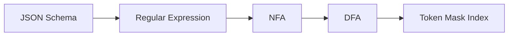

# Constrained Decoding 机制

> LLM 天生输出自由文本，但生产环境中 90% 以上的 API 调用需要结构化数据。Constrained Decoding 在解码层面解决这一矛盾——通过在每一步 token 采样时施加语法约束，**保证输出一定符合目标 schema**。

## 1. 问题：自由文本 vs 结构化需求

LLM 的 next-token prediction 本质上是在词表 $V$ 上生成一个概率分布 $p(x_t | x_{<t})$，然后从中采样。这个过程没有任何结构化保证——模型可能在 JSON 的 value 位置生成自然语言叙述，可能漏掉引号，可能输出不合法的 field name。

在生产环境中，后续系统（数据库写入、API 调用、工作流编排）需要**严格符合 schema 的结构化数据**。模型输出和系统需求之间存在根本性的 gap。

### 1.1 一个典型例子

假设我们需要 LLM 输出如下格式：

```json
{
  "name": "string",
  "age": 18,
  "skills": ["Python", "Go"]
}
```

但模型可能输出：

```
The user's name is Alice and she is 25 years old...
```

或者输出了 JSON 但格式不正确：

```json
{"name": "Alice", "age": "twenty-five", skills: ["Python"]}
```

如何**在解码过程中**就确保输出严格符合 schema？这就是 Constrained Decoding 要解决的问题。

## 2. 方案演进：从粗暴到精准

### 2.1 Post-hoc Parsing：生成后解析

最朴素的方案：让模型自由生成，然后尝试解析输出。

```python
response = llm.generate(prompt + "请输出 JSON 格式...")
try:
    result = json.loads(response)
    validate(result, schema)
except (json.JSONDecodeError, ValidationError):
    # 重试，最多 N 次
    response = llm.generate(prompt + "上次输出格式不对，请重新输出...")
```

**问题**：

- **不可靠**：即使 retry 多次也可能失败，尤其是复杂 schema
- **浪费资源**：每次 retry 都消耗完整的推理资源（prefill + decode）
- **延迟不稳定**：P99 延迟可能是 P50 的 5-10 倍（取决于 retry 次数）
- **无法保证**：从概率上永远不能 100% 保证输出合法

### 2.2 Logit Bias：手动调整 token 概率

通过 API 提供的 `logit_bias` 参数，手动提升或抑制特定 token 的概率。

```python
# 希望模型输出 "yes" 或 "no"
response = llm.generate(
    prompt,
    logit_bias={
        token_id("yes"): 100,  # 大幅提升
        token_id("no"): 100,
    }
)
```

**问题**：

- **表达力有限**：只能控制单个 token，无法表达序列级约束
- **需要精确 tokenization 知识**：同一个词可能被分成多个 token
- **无法处理嵌套结构**：JSON 的括号匹配、数组长度等无法用 logit bias 表达
- **维护成本高**：schema 变更时需要手动更新所有 bias 规则

### 2.3 Grammar-based Constrained Decoding：原则性方案

**核心思想**：将目标 schema 编译为一个形式化的语法（Grammar），在每一步解码时根据当前语法状态计算合法的 token 集合，将不合法的 token 的 logit 设为 $-\infty$。

$$
p'(x_t | x_{<t}) = \begin{cases}
\frac{p(x_t | x_{<t})}{\sum_{x \in \mathcal{V}_{valid}} p(x | x_{<t})} & \text{if } x_t \in \mathcal{V}_{valid} \\
0 & \text{otherwise}
\end{cases}
$$

其中 $\mathcal{V}_{valid} \subseteq V$ 是当前语法状态下合法的 token 集合。

**优势**：

- **100% 保证**：输出一定符合 schema（数学上可证明）
- **单次解码**：不需要 retry
- **与模型解耦**：约束逻辑独立于模型，任何 LLM 都可以使用
- **延迟可预测**：没有 retry 带来的延迟波动

## 3. FSM-based Constrained Decoding

FSM（Finite State Machine，有限状态机）方案是目前最主流的 constrained decoding 实现，以 Outlines 为代表。

### 3.1 编译链路：JSON Schema → Regex → DFA

整个过程分三步：



**Step 1: JSON Schema → Regex**

将 JSON Schema 的类型约束转化为正则表达式。例如：

```python
# Pydantic Model
class User(BaseModel):
    name: str
    age: int
    active: bool

# 编译后的正则（简化表示）
regex = r'\{\s*"name"\s*:\s*"[^"]*"\s*,\s*"age"\s*:\s*\d+\s*,\s*"active"\s*:\s*(true|false)\s*\}'
```

**Step 2: Regex → NFA → DFA**

标准的正则表达式编译过程：

1. 正则表达式 → NFA（Nondeterministic Finite Automaton）：Thompson's construction
2. NFA → DFA（Deterministic Finite Automaton）：Subset construction

DFA 的关键特性：在任意状态下，对于任意输入字符，**下一个状态是唯一确定的**。这让我们可以高效地判断一个 token 是否合法。

**Step 3: DFA → Token Mask Index**

这是 Outlines 的核心创新——**预计算**。对于 DFA 的每一个状态 $s$，预先计算词表中哪些 token 是合法的：

$$
\text{Index}[s] = \{t \in V \mid \text{token } t \text{ 能从状态 } s \text{ 合法转移}\}
$$

### 3.2 运行时：逐 token 约束

解码过程中，维护当前 DFA 状态 $s_t$：

```
初始化: s₀ = DFA 起始状态
对于每一步 t:
  1. 查表: valid_tokens = Index[sₜ]
  2. 构建 mask: mask[i] = 0 if token_i ∈ valid_tokens, else -∞
  3. 修改 logits: logits' = logits + mask
  4. 采样: xₜ ~ softmax(logits')
  5. 更新状态: sₜ₊₁ = DFA.transition(sₜ, xₜ)
```

### 3.3 Token 粒度问题

一个关键的工程难点：**token 和 schema 字符不是一一对应的**。

例如，BPE tokenizer 可能将 `"name"` 编码为单个 token，也可能拆成 `"` + `name` + `"` 三个 token。一个 token 可能跨越 JSON 的多个语法元素：

```
Token: `,"age":` — 同时包含逗号、key 字符串、冒号
```

因此，判断一个 token 是否合法需要模拟 DFA 在该 token 对应的**所有字符**上的转移：

$$
\text{valid}(t, s) = \exists s' : s \xrightarrow{c_1} s_1 \xrightarrow{c_2} \cdots \xrightarrow{c_n} s'
$$

其中 $c_1, c_2, \ldots, c_n$ 是 token $t$ 对应的字符序列，且所有中间状态都是合法的 DFA 状态。

### 3.4 预计算的代价

预计算 Index 表的复杂度为 $O(|S| \times |V|)$，其中 $|S|$ 是 DFA 状态数，$|V|$ 是词表大小。

| 因素 | 典型值 | 说明 |
|------|--------|------|
| DFA 状态数 $\|S\|$ | 几十 ~ 几千 | 取决于 schema 复杂度 |
| 词表大小 $\|V\|$ | 32K ~ 128K | 取决于 tokenizer |
| Index 表大小 | 几 MB ~ 几百 MB | 稀疏存储可大幅压缩 |
| 预计算时间 | 几十 ms ~ 几秒 | 可缓存复用 |

对于常见的 JSON Schema，预计算耗时通常在 **100ms 以内**，并且可以按 schema 缓存——同一个 schema 只需编译一次。

## 4. CFG-based Constrained Decoding

### 4.1 FSM 的局限

正则表达式（等价于 FSM/DFA）无法处理**嵌套结构**。例如：

- 递归的 JSON 结构：对象中嵌套对象，数组中嵌套数组
- 括号匹配：`{` 和 `}` 的配对
- XML/HTML 的嵌套标签

这些都需要更强的表达力——**上下文无关文法（Context-Free Grammar, CFG）**。

### 4.2 CFG 与 Pushdown Automaton

CFG 使用产生式规则描述语言结构，对应的自动机是 **Pushdown Automaton（PDA，下推自动机）**——在 DFA 基础上增加了一个栈（stack）来跟踪嵌套层级。

```
# GBNF 格式的 JSON 文法（llama.cpp 使用）
root   ::= object
object ::= "{" ws (pair ("," ws pair)*)? "}" ws
pair   ::= string ":" ws value
value  ::= string | number | object | array | "true" | "false" | "null"
array  ::= "[" ws (value ("," ws value)*)? "]" ws
string ::= "\"" [^"\\]* "\""
number ::= "-"? [0-9]+ ("." [0-9]+)?
ws     ::= [ \t\n]*
```

### 4.3 CFG vs FSM 的取舍

| 维度 | FSM (Regex/DFA) | CFG (PDA) |
|------|----------------|-----------|
| 表达力 | 正则语言 | 上下文无关语言 |
| 嵌套支持 | 不支持（或有限深度近似） | 原生支持 |
| 运行时开销 | $O(1)$ 每字符（查表） | $O(n)$ 到 $O(n^3)$ 取决于文法 |
| 预计算 | 完全确定性，Index 表可缓存 | 部分预计算，栈状态动态变化 |
| 实现复杂度 | 低 | 高 |
| 典型场景 | 扁平 JSON、枚举类型、固定格式 | 递归 JSON、XML、代码生成 |

**实践中的折中**：大多数生产场景的 JSON Schema 嵌套层级有限（通常 < 5 层）。Outlines 等框架通过将有限深度嵌套的 JSON "展开"为正则表达式来处理，避免引入 CFG 的复杂性。只有真正需要任意深度嵌套的场景才使用 CFG。

## 5. 主流实现

### 5.1 Outlines

[Outlines](https://github.com/dottxt-ai/outlines) 是最成熟的 FSM-based 结构化生成框架：

- **编译链路**：JSON Schema → Regex → DFA → Token Index
- **预计算**：为每个 DFA 状态预计算合法 token 集合
- **集成**：vLLM、TGI、SGLang 均支持 Outlines 后端
- **特色**：支持 Pydantic model 直接作为 schema 输入

```python
from outlines import models, generate
from pydantic import BaseModel

class UserInfo(BaseModel):
    name: str
    age: int
    skills: list[str]

model = models.transformers("meta-llama/Llama-3-8B-Instruct")
generator = generate.json(model, UserInfo)

# 生成的 result 一定是合法的 UserInfo 对象
result = generator("Extract user info: Alice is 25, knows Python and Go")
# → UserInfo(name='Alice', age=25, skills=['Python', 'Go'])
```

### 5.2 llama.cpp GBNF Grammars

[llama.cpp](https://github.com/ggml-org/llama.cpp) 使用 GBNF（GGML BNF）格式定义文法，支持 CFG-based constrained decoding：

- **表达力**：完整的上下文无关文法，支持递归
- **适用场景**：本地推理、边缘设备部署
- **实现**：在 sampling 阶段应用文法约束

### 5.3 vLLM Guided Decoding

vLLM 集成了多种 constrained decoding 后端：

- **Outlines 后端**：FSM-based，默认后端
- **xgrammar 后端**：高性能 CFG-based 解码
- **API 兼容**：通过 OpenAI-compatible API 的 `response_format` 参数使用

```python
from openai import OpenAI

client = OpenAI(base_url="http://localhost:8000/v1")

response = client.chat.completions.create(
    model="meta-llama/Llama-3-8B-Instruct",
    messages=[{"role": "user", "content": "Extract user info from: ..."}],
    response_format={
        "type": "json_schema",
        "json_schema": {
            "name": "user_info",
            "schema": {
                "type": "object",
                "properties": {
                    "name": {"type": "string"},
                    "age": {"type": "integer"},
                },
                "required": ["name", "age"]
            }
        }
    }
)
```

### 5.4 SGLang

[SGLang](https://github.com/sgl-project/sglang) 在其 Runtime 中原生支持结构化输出：

- **高效的 grammar 编译**：与 RadixAttention 协同
- **Compressed FSM**：通过合并 DFA 状态减少开销
- **Jump-forward 优化**：当只有一个合法 token 时跳过采样（详见 [02-serving-interaction.md](02-serving-interaction.md)）

## 6. 小结

| 方案 | 保证强度 | 延迟开销 | 适用场景 |
|------|---------|---------|---------|
| Post-hoc parsing | 无保证 | retry 带来不确定延迟 | 原型验证 |
| Logit bias | 单 token 级 | 极低 | 简单分类/选择 |
| FSM (Regex/DFA) | 正则语言级 | 低（预计算后） | 扁平 JSON、枚举 |
| CFG (PDA) | 上下文无关级 | 中 | 递归 JSON、代码 |

从 serving 的角度看，grammar-based constrained decoding 是目前最优的方案——它在保证输出合规的同时，将额外开销控制在可接受的范围内。下一节我们将深入分析这个"可接受的范围"具体是多少，以及它与 serving pipeline 各组件的交互。
