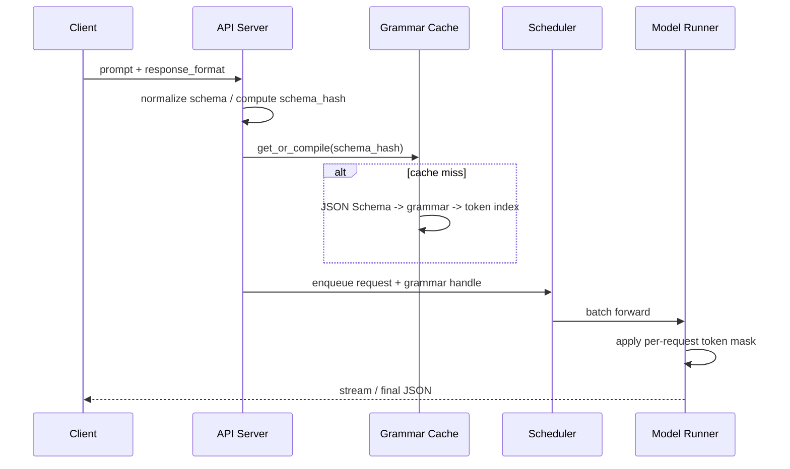

# 结构化输出容量规划与上线 Runbook

> Constrained decoding 的难点不在“能不能生成合法 JSON”，而在大规模服务中如何控制 schema 编译、缓存、延迟尾部和失败模式。本节把 Ch12 前三节的原理落到上线流程。

## 1. 请求路径拆解

一个 structured output 请求在 serving 侧可以拆成 6 个阶段：



关键点：schema 编译在请求进入 decode 循环前完成；decode 循环里只应该做轻量级的 mask 查询和 logits 修改。如果把 schema 编译放进每个 decode step，系统会出现极端尾延迟。

## 2. 容量估算

### 2.1 Grammar Cache 内存

粗略估算：

$$
\text{mask\_bytes} \approx \frac{|S| \times |V|}{8}
$$

其中 $|S|$ 是 grammar 状态数，$|V|$ 是 tokenizer 词表大小。实际实现通常用稀疏表示、压缩 bitset 或按需 materialize，真实内存可能低于这个上界，但上线前应按上界保守预估。

| Schema 类型 | 状态数估计 | 128K 词表 bitset 上界 | 建议 |
|-------------|-----------|----------------------|------|
| 5 个扁平字段 | 50 | 0.8 MB | 可大量缓存 |
| 20 个字段 + enum | 200 | 3.2 MB | 预热 Top-N |
| 2-3 层嵌套对象 | 800 | 12.8 MB | 设置缓存上限 |
| 递归/复杂 CFG | 动态 | 难以上界化 | 单独限流 |

如果日常有 500 个常用 schema，每个平均 200 状态，那么 bitset 上界约为：

```
500 × 200 × 128000 / 8 ≈ 1.6 GB
```

这对 CPU 内存通常可接受，但如果把 mask 常驻 GPU，需要更严格控制。

### 2.2 编译延迟预算

schema cache miss 会直接影响 TTFT。一个实用预算：

| 阶段 | 目标 | 超过后动作 |
|------|------|------------|
| schema normalize/hash | <5 ms | 检查 JSON schema 大小 |
| grammar compile | <100 ms | 异步预热或拒绝复杂 schema |
| token index build | <200 ms | 启用缓存、压缩或 backend 切换 |
| total cold compile | <300 ms | 对外标记 cold-start 延迟 |

对在线服务来说，**cache miss rate 比平均编译时间更重要**。一个 1 秒 cold compile 如果命中率 99.9%，影响可控；如果每个请求都带动态 schema，P99 会很快失控。

## 3. Schema 设计规范

### 3.1 推荐写法

- 给每个字段明确类型，避免 `anyOf` / `oneOf` 过多分支。
- 对字符串使用 enum 或短 description 约束语义，但不要用超长正则表达式表达业务逻辑。
- 对数组设置 `maxItems`，否则模型可能生成很长列表，decode 成本不可控。
- 设置 `additionalProperties: false`，避免模型扩展未定义字段。
- schema 版本化：`schema_name + schema_version` 一起进入 cache key。

### 3.2 不推荐写法

```json
{
  "type": "object",
  "properties": {
    "data": {},
    "items": {"type": "array"},
    "value": {"oneOf": [{"type": "string"}, {"type": "number"}, {"type": "object"}]}
  }
}
```

问题：约束太松，无法降低解析风险；分支太多，grammar 状态膨胀；数组无上限，输出长度不可控。

更好的写法：

```json
{
  "type": "object",
  "additionalProperties": false,
  "properties": {
    "intent": {"type": "string", "enum": ["search", "refund", "handoff"]},
    "confidence": {"type": "number", "minimum": 0, "maximum": 1},
    "slots": {
      "type": "array",
      "maxItems": 8,
      "items": {
        "type": "object",
        "additionalProperties": false,
        "properties": {
          "name": {"type": "string"},
          "value": {"type": "string"}
        },
        "required": ["name", "value"]
      }
    }
  },
  "required": ["intent", "confidence", "slots"]
}
```

## 4. Backend 选择

| Backend 类型 | 优势 | 风险 | 适用场景 |
|--------------|------|------|----------|
| FSM / regex | 速度快、缓存简单 | 递归表达力弱 | 扁平 JSON、enum、分类抽取 |
| CFG / xgrammar | 表达力强、嵌套友好 | 运行时状态更复杂 | 深层 JSON、代码、DSL |
| post-hoc parse | 无 serving 改造 | 不保证、需 retry | 原型验证 |
| API provider SO | 运维简单 | 成本和可观测性受限 | 业务侧快速上线 |

生产建议：默认选引擎内置 structured outputs backend；只有当 schema 非常简单且性能极敏感时，才单独评估 FSM backend 的收益；复杂嵌套优先使用 CFG backend。

## 5. 失败模式与排查

| 现象 | 可能原因 | 排查方式 | 处理 |
|------|----------|----------|------|
| TTFT 突增 | schema cache miss | 看 `schema_compile_seconds` | 预热 schema |
| 吞吐下降 >20% | schema 状态数过大 | 打印 state count / mask size | 拆 schema 或换 backend |
| 输出语义奇怪 | schema 与 prompt 冲突 | 看 forced-token ratio | 调整 schema / prompt |
| streaming 客户端解析失败 | 客户端按完整 JSON parse chunk | 检查客户端日志 | 改 incremental parser |
| cache 内存上涨 | 动态 schema 过多 | 看 schema_hash cardinality | 限制 schema 注册 |

## 6. 上线 Checklist

- [ ] 所有生产 schema 有稳定的 `name` 和 `version`。
- [ ] 启动时预热 Top-N schema，记录 cold compile 时间。
- [ ] 对动态 schema 设置大小、深度、数组长度上限。
- [ ] Dashboard 包含：compile latency、cache hit rate、state count、forced-token ratio、guided vs baseline latency。
- [ ] 压测覆盖 cache hit 和 cache miss 两类请求。
- [ ] streaming 客户端支持 partial JSON 或 field-level event。
- [ ] fallback 策略明确：backend 故障时是降级到 JSON mode、post-hoc parse，还是拒绝请求。
- [ ] schema 变更有灰度：新版本 schema 先 1% 流量，再扩大。

## 7. 一个参考灰度流程

```
Day 0: 离线编译所有 schema，检查状态数和编译耗时
Day 1: 影子流量，只记录 guided 输出，不影响线上结果
Day 2: 1% 流量启用 structured output，监控 TTFT / 合规率
Day 3: 10% 流量，加入 streaming 场景和高并发场景
Day 4: 50% 流量，观察 cache 内存和 backend 错误
Day 5: 100% 流量，保留 JSON mode fallback 一周
```

结构化输出一旦进入生产，schema 就变成了 serving contract。把它当作 API 版本管理，而不是 prompt 的附属品，系统会稳定很多。
