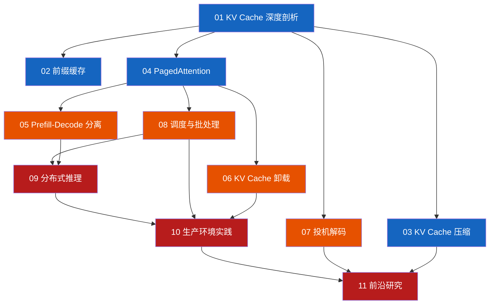

# LLM Serving 深度学习指南

> 从 KV Cache 到生产级部署——深入理解大模型推理服务的每一个关键环节

## 📖 项目定位

本仓库是一份**面向有一定基础的工程师**的 LLM Serving 深度学习指南。如果你已经了解 Transformer 基本原理、知道 KV Cache 是什么、用过 vLLM 部署模型，但想要：

- 读懂 vLLM / SGLang 的核心源码
- 理解各大 API 提供商（OpenAI、Anthropic、Google）如何实现 Prompt Caching
- 掌握 Disaggregated Prefill、Speculative Decoding 等前沿优化的设计决策
- 在生产环境中做出正确的架构选择

那么这份指南就是为你准备的。

### 与 [gpu-ai-systems-learning](https://github.com/NightLemon/gpu-ai-systems-learning) 的关系

| 维度 | gpu-ai-systems-learning | 本仓库 |
|------|------------------------|--------|
| 定位 | 12 周广度入门课程 | 专题深度研究 |
| 覆盖范围 | GPU 架构 → CUDA → 训练 → 推理 | 仅聚焦推理服务 |
| 深度 | 概念 + 公式 + 入门代码 | 论文解读 + 源码走读 + 工程实践 |
| 前置要求 | 后端工程经验 | 已学完 gpu-ai-systems-learning Ch01-07 或等价知识 |

## 📋 目录

| 章节 | 主题 | 难度 | 侧重 |
|------|------|------|------|
| [01](01-kv-cache-internals/) | KV Cache 深度剖析 | ⭐⭐ | 原理 + 源码 |
| [02](02-prefix-caching/) | 前缀缓存与 Prompt Caching | ⭐⭐ | 原理 + 工程 |
| [03](03-kv-cache-compression/) | KV Cache 压缩 | ⭐⭐⭐ | 论文 + 原理 |
| [04](04-paged-attention/) | PagedAttention 与内存管理 | ⭐⭐⭐ | 源码 |
| [05](05-disaggregated-serving/) | Prefill-Decode 分离架构 | ⭐⭐⭐ | 论文 + 源码 |
| [06](06-kv-offloading/) | KV Cache 卸载 | ⭐⭐⭐ | 论文 + 工程 |
| [07](07-speculative-decoding/) | 投机解码进阶 | ⭐⭐⭐ | 论文 + 源码 |
| [08](08-scheduling-batching/) | 调度与批处理 | ⭐⭐⭐ | 源码 + 工程 |
| [09](09-distributed-inference/) | 分布式推理 | ⭐⭐⭐⭐ | 论文 + 源码 |
| [10](10-production-patterns/) | 生产环境实践 | ⭐⭐⭐ | 工程 |
| [11](11-frontier-research/) | 前沿研究 | ⭐⭐⭐⭐ | 论文 |

## 🗺️ 学习路线图



**颜色说明：**
- 🔵 蓝色：基础层（Ch01-04），可并行学习
- 🟠 橙色：进阶层（Ch05-08），依赖基础层
- 🔴 红色：应用/前沿层（Ch09-11），依赖进阶层

## 📅 建议学习计划

### Phase 1：KV Cache 全貌（Week 1-2）
- Ch01 KV Cache Internals — 从显存布局到 Block Table
- Ch02 Prefix Caching — 理解 cache hit 的本质
- Ch03 KV Cache Compression — 用更少显存存更多 cache

### Phase 2：内存管理与架构（Week 3-4）
- Ch04 PagedAttention — 走读 vLLM 核心源码
- Ch05 Disaggregated Serving — 理解 prefill-decode 分离的 why 和 how
- Ch06 KV Offloading — GPU→CPU→SSD 分层存储

### Phase 3：解码与调度（Week 5-6）
- Ch07 Speculative Decoding — EAGLE、Medusa、MTP
- Ch08 Scheduling & Batching — 调度器源码与策略分析

### Phase 4：生产与前沿（Week 7-8）
- Ch09 Distributed Inference — TP/PP/EP 在推理中的应用
- Ch10 Production Patterns — 上线前的最后一课
- Ch11 Frontier Research — 追踪最新进展

## 🔧 每章结构

每个章节包含以下部分：

```
章节目录/
├── README.md          # 概述、学习目标、核心概念
├── 01-原理.md         # 论文解读与理论推导
├── 02-源码.md         # 关键源码走读（标注文件路径和版本）
├── 03-工程.md         # 配置调优、性能测试、生产建议
└── exercises.md       # 动手练习
```

## 🎯 前置知识

- ✅ 理解 Transformer self-attention 机制
- ✅ 知道 KV Cache 的基本概念和作用
- ✅ 用过 vLLM 或类似框架部署过模型
- ✅ 有 Python 编程经验，能读 PyTorch 代码
- ✅ （推荐）学完 [gpu-ai-systems-learning](https://github.com/NightLemon/gpu-ai-systems-learning) Ch01-07

## 📚 核心参考

| 资源 | 说明 |
|------|------|
| [vLLM 源码](https://github.com/vllm-project/vllm) | 本仓库最核心的参考实现 |
| [SGLang](https://github.com/sgl-project/sglang) | RadixAttention 和 cache-aware 调度 |
| [PagedAttention 论文](https://arxiv.org/abs/2309.06180) | SOSP 2023，vLLM 奠基论文 |
| [DeepSeek-V2 论文](https://arxiv.org/abs/2405.04434) | MLA 架构，KV Cache 压缩代表作 |
| [Anthropic Prompt Caching 文档](https://docs.anthropic.com/en/docs/build-with-claude/prompt-caching) | API 级 caching 最佳实践 |
| [vLLM 文档](https://docs.vllm.ai/en/latest/) | 官方文档，持续更新 |

## License

MIT
