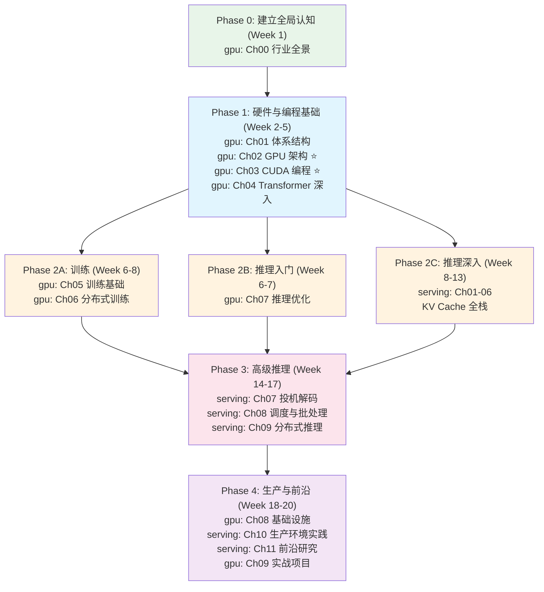

# GPU & AI Systems + LLM Serving 综合学习规划

> 本指南整合 [gpu-ai-systems-learning](https://github.com/NightLemon/gpu-ai-systems-learning)（基础篇，10 章）和 [llm-serving-deep-dive](https://github.com/NightLemon/llm-serving-deep-dive)（进阶篇，11 章）两份材料，给出一条从零到生产的完整学习路线。

## 两份材料的关系

```
gpu-ai-systems-learning（广度）          llm-serving-deep-dive（深度）
──────────────────────────              ─────────────────────────────
Ch00 行业全景                            
Ch01 计算机体系结构                       
Ch02 GPU 架构                ──→ 理解硬件约束
Ch03 CUDA 编程               ──→ 理解 kernel 优化
Ch04 Transformer 深入        ──→ 理解模型结构
Ch05 训练基础                             
Ch06 分布式训练              ──→ 对照 Serving Ch09 分布式推理
Ch07 推理优化（入门）         ──→ Serving Ch01-11（全面深入）
Ch08 基础设施                ──→ 对照 Serving Ch10 生产实践
Ch09 实战项目                             
```

**一句话总结**：gpu-ai-systems-learning 让你"知道有什么"，llm-serving-deep-dive 让你"知道怎么做"。

---

## 确认你的起点

### Level 0：完全新手
你对 GPU、CUDA、Transformer 都不太了解。
→ 从 gpu-ai-systems-learning Ch00 开始，走完整路径。

### Level 1：有 ML 背景
你用过 PyTorch 训练模型，了解 Transformer，但不太懂 GPU 硬件和系统优化。
→ 从 gpu-ai-systems-learning Ch02 开始，跳过 Ch00-01。

### Level 2：有推理部署经验
你用过 vLLM/TGI 部署模型，知道 KV Cache 是什么，但想深入理解原理。
→ 直接进入 llm-serving-deep-dive Ch01，需要时回 gpu-ai-systems-learning 补课。

### Level 3：想专攻某个方向
你有明确的技术问题要解决（OOM、延迟优化、成本优化等）。
→ 跳到下面的"问题驱动路径"。

---

## 完整学习路线（20 周）

适合想系统掌握从 GPU 硬件到生产部署全栈知识的人。



### 详细周计划

#### Phase 0: 建立全局认知（Week 1）

| 周 | 内容 | 目标 | 验证 |
|----|------|------|------|
| W1 | gpu Ch00 行业全景 | 理解训练和推理的成本结构，知道后续每章在解决什么问题 | 能画出 LLM 从训练到上线的完整 pipeline |

> 这周很轻松，目的是建立全景视野。读完 Ch00 后快速翻一遍两个 repo 的目录，心里有个地图。

#### Phase 1: 硬件与编程基础（Week 2-5）

| 周 | 内容 | 目标 | 验证 |
|----|------|------|------|
| W2 | gpu Ch01 体系结构 | CPU Cache、NUMA、SIMD，理解为什么 GPU 更适合并行 | 能解释 False Sharing 和 NUMA 对性能的影响 |
| W3 | gpu Ch02 GPU 架构 | SM/Warp/HBM 层级结构，A100/H100 关键参数 | 能说出 H100 有多少 SM、HBM 带宽多少 |
| W4 | gpu Ch03 CUDA (上) | Kernel 编写、内存管理、Shared Memory | 能写一个简单的矩阵乘法 kernel |
| W5 | gpu Ch03 CUDA (下) + Ch04 Transformer | GEMM 优化 + Attention 计算分析 | 能估算 70B 模型需要几张 A100 |

> **Phase 1 是地基**。Ch02-03 是理解一切 GPU 优化的前提。如果时间紧，Ch01 可以略读。

#### Phase 2: 分叉学习（Week 6-13）

训练和推理可以并行学，也可以按兴趣选择侧重。

##### 2A: 训练路线（Week 6-8）

| 周 | 内容 | 目标 | 验证 |
|----|------|------|------|
| W6 | gpu Ch05 训练基础 | 混合精度、梯度检查点、数据加载 | 理解 BF16 为什么比 FP16 更稳定 |
| W7 | gpu Ch06 分布式训练 (上) | 通信原语、DDP、ZeRO | 能解释 Ring AllReduce 的通信量公式 |
| W8 | gpu Ch06 分布式训练 (下) | TP、PP、EP、Megatron-LM | 给定模型大小能选出并行策略 |

##### 2B: 推理入门（Week 6-7）

| 周 | 内容 | 目标 | 验证 |
|----|------|------|------|
| W6 | gpu Ch07 推理优化 (上) | KV Cache、量化、Continuous Batching | 理解为什么 Continuous Batching 能提升 2-8x 吞吐 |
| W7 | gpu Ch07 推理优化 (下) | FlashAttention、vLLM 架构、投机解码概念 | 能解释 FlashAttention 为什么又快又省显存 |

##### 2C: 推理深入 — KV Cache 全栈（Week 8-13）

这是从 gpu-ai-systems-learning 过渡到 llm-serving-deep-dive 的关键阶段。

| 周 | 内容 | 目标 | 验证 |
|----|------|------|------|
| W8 | serving Ch01 KV Cache 深度剖析 | MHA/GQA/MLA 的 memory layout、prefill vs decode 的 AI 对比 | 用 Python 算出常用模型的 KV Cache 大小 |
| W9 | serving Ch02 前缀缓存 + Ch03 KV Cache 压缩 | APC/RadixAttention、MLA 57x 压缩比推导 | 调 API 观察 cached token 计费 |
| W10 | serving Ch04 PagedAttention | Block Table 映射、preemption 策略 | 画出 vLLM block 分配流程图 |
| W11 | serving Ch05 Prefill-Decode 分离 | 分离架构的 why、KV Transfer 带宽计算 | 计算分离架构的 break-even point |
| W12 | serving Ch06 KV Offloading | GPU→CPU→SSD 分层、offload vs recompute 决策 | 估算 offloading 延迟和收益 |

> **W8-W12 是两份材料的衔接地带**。gpu Ch07 给了你概念，serving Ch01-06 让你深入到源码级别。

#### Phase 3: 高级推理优化（Week 14-17）

| 周 | 内容 | 目标 | 验证 |
|----|------|------|------|
| W14 | serving Ch07 投机解码 | rejection sampling 证明、EAGLE/Medusa/MTP | 用 vLLM 跑投机解码，观察 accept rate |
| W15 | serving Ch08 调度与批处理 | vLLM Scheduler 源码、chunked prefill 权衡 | 调参观察 TTFT vs 吞吐量变化 |
| W16 | serving Ch09 分布式推理 (上) | TP/PP 在推理中的实现差异（对比 gpu Ch06 训练时） | 对比推理 TP 和训练 TP 的通信模式 |
| W17 | serving Ch09 分布式推理 (下) | EP/DP/CP、混合并行决策框架 | 给定 workload 能选出部署方案 |

> **W16 是连接训练和推理的关键一周**。对比 gpu Ch06（训练视角的并行）和 serving Ch09（推理视角的并行），理解两者的差异。

#### Phase 4: 生产与实战（Week 18-20）

| 周 | 内容 | 目标 | 验证 |
|----|------|------|------|
| W18 | gpu Ch08 基础设施 + serving Ch10 生产实践 | 集群网络、监控、Cache-aware 路由、成本优化 | 搭建 Prometheus + Grafana 监控 vLLM |
| W19 | serving Ch11 前沿研究 | Hybrid KV Cache、编译优化、成本趋势 | 读 1-2 篇论文并写总结 |
| W20 | gpu Ch09 实战项目 | GEMM 优化 + 推理服务部署 | 跑通 03-inference-serving 项目 |

---

## 精简路线（12 周）

如果时间有限，按这个顺序走。用 `(选读)` 标注的可以跳过。

```
W1-2:  gpu Ch02 GPU 架构 + Ch03 CUDA（上半）
W3:    gpu Ch04 Transformer + Ch07 推理优化
W4:    serving Ch01 KV Cache + Ch04 PagedAttention
W5-6:  serving Ch02 前缀缓存 + Ch03 压缩 + Ch05 分离架构
W7:    serving Ch07 投机解码
W8:    serving Ch08 调度
W9:    gpu Ch06 分布式训练 (选读: 只看 TP/PP/EP)
W10:   serving Ch09 分布式推理
W11:   serving Ch10 生产实践
W12:   gpu Ch09-03 推理服务实战项目

跳过: gpu Ch00, Ch01, Ch05, Ch08 / serving Ch06, Ch11
```

---

## 问题驱动路径

不想按顺序学？直接按你的问题找：

| 你的问题 | gpu-ai-systems-learning | llm-serving-deep-dive |
|---------|------------------------|----------------------|
| "不懂 GPU 硬件" | **Ch02 GPU 架构** → Ch03 CUDA | — |
| "不懂 Transformer" | **Ch04 Transformer** | — |
| "想学分布式训练" | Ch05 训练基础 → **Ch06 分布式** | — |
| "vLLM OOM 了" | Ch02 (HBM 容量) | **Ch01 → Ch04** → Ch03 |
| "TTFT 太高" | — | **Ch08 (chunked prefill)** → Ch05 |
| "单卡放不下模型" | Ch06 (TP/PP 概念) | **Ch09 (推理并行)** |
| "想理解 DeepSeek-V3" | — | **Ch03 (MLA)** → Ch09 (EP) → Ch07 (MTP) |
| "想理解 FlashAttention" | Ch02 (显存层级) → **Ch07-05** | — |
| "成本太高想优化" | — | **Ch10** → Ch02 (caching) → Ch07 (spec) |
| "要上生产" | Ch08 (基础设施) | **Ch10 (全读)** → Ch08 → Ch04 |
| "面试准备" | Ch02 → Ch04 | **Ch01 → Ch04 → Ch08** → Ch07 |

---

## 两份材料的交叉阅读建议

有些主题在两份材料中都出现了，但深度和角度不同。以下是值得交叉对比的章节：

### 1. KV Cache
| | gpu Ch07-01 | serving Ch01 |
|-|-------------|-------------|
| 深度 | 概念介绍 + 显存公式 | 完整的 memory layout、MHA/GQA/MLA 对比、prefill vs decode 的 AI 分析 |
| 建议 | 先读 gpu 建立概念 | 再读 serving 深入理解 |

### 2. 并行策略 (TP/PP/EP)
| | gpu Ch06 | serving Ch09 |
|-|----------|-------------|
| 视角 | 训练：前向 + 反向 + 梯度同步 | 推理：只有前向，通信更简单但延迟更敏感 |
| 建议 | 先学训练视角，理解完整的通信模式 | 再对比推理视角，理解为什么推理的并行决策不同 |

### 3. vLLM
| | gpu Ch07-06 | serving Ch04/Ch08 |
|-|-------------|------------------|
| 深度 | 架构概览 + PagedAttention 概念 | Block Table 源码走读、Scheduler 完整流程、preemption 策略 |
| 建议 | 先读 gpu 了解全貌 | 再读 serving 进入源码 |

### 4. 基础设施 & 生产
| | gpu Ch08 | serving Ch10 |
|-|----------|-------------|
| 侧重 | 集群层面：网络、存储、K8s、监控 | 服务层面：路由、指标、profiling、成本、HA |
| 建议 | 两者互补，可以同一周内一起读 |

---

## 核心学习原则

### 1. 数字比文字重要

两份材料最有价值的不是文字描述，而是**可以算的公式**：

```python
# 这些计算要练到条件反射的程度：

# KV Cache 大小
kv_per_token = 2 * num_layers * num_kv_heads * head_dim * dtype_bytes

# 模型显存
model_mem = num_params * dtype_bytes  # 70B FP16 = 140 GB

# Arithmetic Intensity
AI_prefill = 2 * seq_len * d * d / (d * d * dtype_bytes)  # ≈ seq_len
AI_decode  = 2 * 1 * d * d / (d * d * dtype_bytes)        # ≈ 1

# TP 通信量
allreduce_per_layer = 2 * (tp-1)/tp * batch_tokens * hidden_dim * dtype_bytes
```

### 2. 先读概念（gpu），再读实现（serving）

gpu-ai-systems-learning 给你建立正确的心智模型，llm-serving-deep-dive 用源码和论文验证这些模型。跳过概念直接看实现会很痛苦。

### 3. 每学完一个主题，做一次对比

学完 serving Ch09 后，回去翻 gpu Ch06，问自己：
- 训练时的 TP 和推理时的 TP 有什么不同？
- 为什么训练需要 PP 的 1F1B，但推理不需要？
- EP 在训练和推理中的 All-to-All 通信有什么区别？

这种对比是最深度的学习。

### 4. 验算每一个数字

遇到任何数值，停下来用 Python 算一遍。如果算出来不一样，要么你理解有误，要么材料有误——无论哪种，你都学到了东西。

---

## 自测里程碑

### Checkpoint 1: 硬件基础（完成 Phase 1 后）
- [ ] 能解释 GPU 的 SM → Warp → Thread 执行层级
- [ ] 能说出 A100/H100 的 SM 数量、HBM 带宽、NVLink 带宽
- [ ] 能写一个基本的 CUDA kernel 并理解 tiling 优化
- [ ] 能估算 70B 模型的显存需求和 FLOPs

### Checkpoint 2: 推理基础（完成 Phase 2 后）
- [ ] 给定模型参数，3 分钟内算出 KV Cache 大小
- [ ] 能解释 prefill 是 compute-bound、decode 是 memory-bound
- [ ] 能画出 vLLM 的 Block Table 分配流程
- [ ] 理解 MLA 的 57x 压缩比是怎么来的

### Checkpoint 3: 高级推理（完成 Phase 3 后）
- [ ] 能推导投机解码的无损性证明（至少说清楚直觉）
- [ ] 能解释 vLLM scheduler 的 schedule() 做了哪几步
- [ ] 给定模型和硬件，能选出 TP/PP/EP/DP 组合并说出理由
- [ ] 理解 chunked prefill 的 chunk size 对 TTFT/TBT 的影响

### Checkpoint 4: 生产就绪（完成 Phase 4 后）
- [ ] 能配置 Prometheus 监控 vLLM 并解读关键指标
- [ ] 能写一份推理服务技术选型文档
- [ ] 读过 3+ 篇 Ch11 论文列表中的论文
- [ ] 跑通一个完整的推理服务部署实验

---

## 学习工具

| 工具 | 用途 | 对应阶段 |
|------|------|---------|
| Python + Jupyter | 验算、画图 | 全程 |
| vLLM 源码 | 对照阅读 | Phase 2C 起 |
| NVIDIA GPU (任意) | 跑 CUDA 和推理实验 | Phase 1 起 |
| Nsight Systems / Nsight Compute | GPU profiling | Phase 1 (CUDA), Phase 4 (profiling) |
| Prometheus + Grafana | 监控 | Phase 4 |
| Claude / GPT | 读论文的讨论伙伴 | 全程 |

---

## 学完之后

完成 20 周学习后，你应该具备：

**硬件层面**：理解 GPU 架构，能用 CUDA 写和优化 kernel
**框架层面**：读懂 vLLM/Megatron 源码，能参与社区讨论
**系统层面**：给定 workload 能设计端到端推理服务架构
**生产层面**：能搭建监控、做成本优化、处理故障

**下一步**：
- 给 vLLM 提 PR
- 读 SGLang 源码，看另一种设计
- 关注 MLSys / OSDI / SOSP 的系统方向论文
- 最重要的——在真实流量中验证你学到的一切
